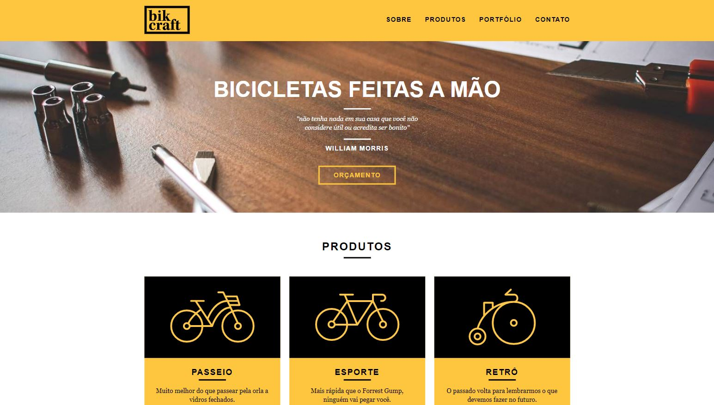

<h1 align="center">
    
</h1>

<p align="center">
  <a href="#-project">Project</a>&nbsp;&nbsp;&nbsp;|&nbsp;&nbsp;&nbsp;
  <a href="#-technologies">Technologies</a>&nbsp;&nbsp;&nbsp;|&nbsp;&nbsp;&nbsp;
  <a href="#-how-to-run">How to run</a>
</p>

<p align="center">
  
</p>

## 💻 Project

Responsive website of Bikcraft, a custom bike company that integrates design, comfort and efficiency.

> You can check the website [demo](https://marcelopajr.github.io/bikcraft/) here!

## 🔧 Technologies

- [HTML](https://developer.mozilla.org/en-US/docs/Web/HTML)
- [CSS](https://developer.mozilla.org/en-US/docs/Web/CSS)
- [JavaScript](https://developer.mozilla.org/en-US/docs/Web/JavaScript)
- [Adobe XD](https://www.adobe.com/products/xd.html)

## 😊 How to run

```sh
- Clone this repo:
$ git clone https://github.com/marcelopajr/bikcraft.git

- Enter directory:
$ cd bikcraft

- Open Visual Studio Code:
$ code .

- Launch the website:
Run Live Server extension
```

Have fun!
